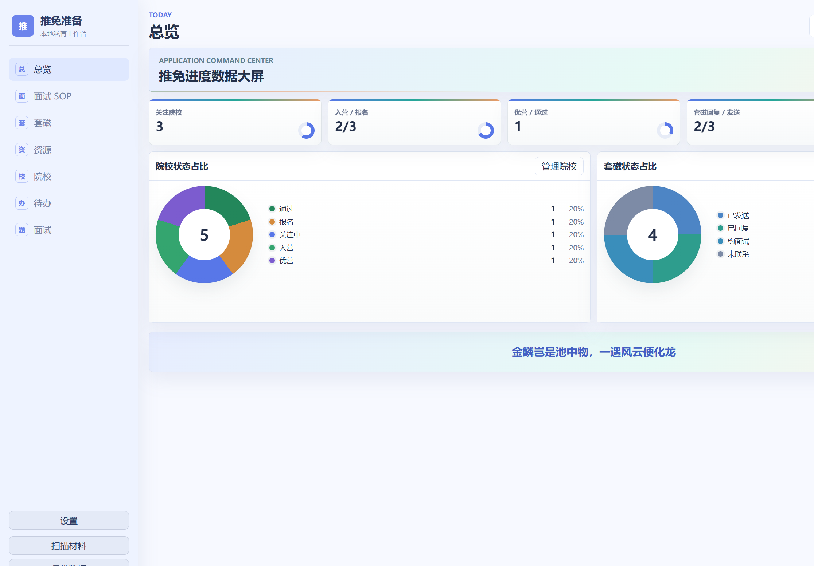
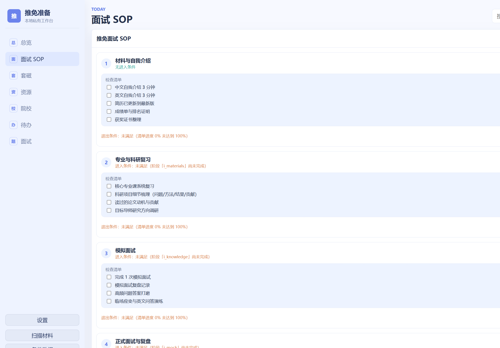
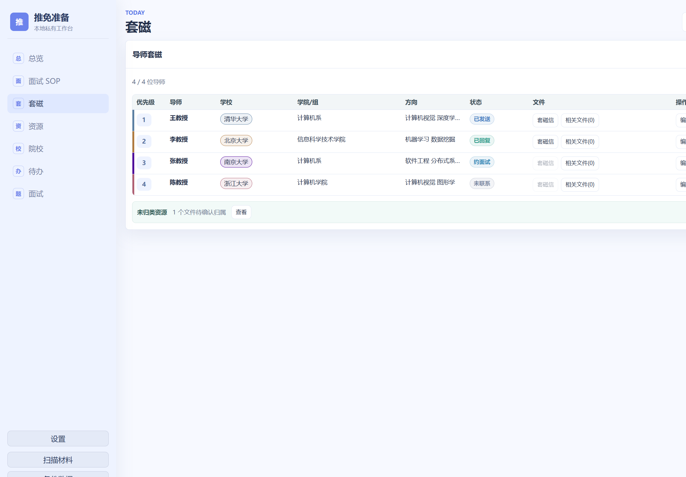
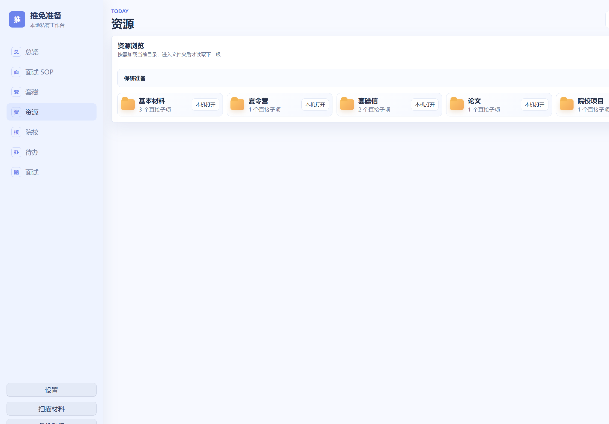
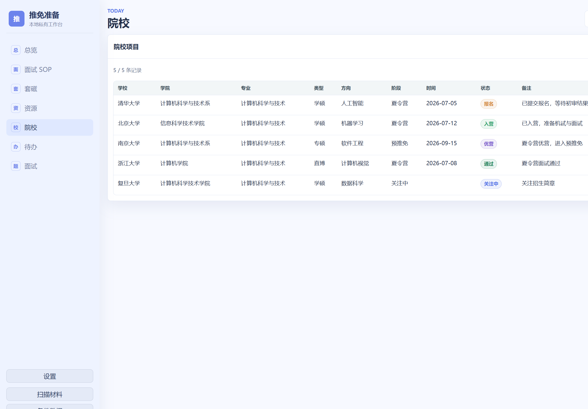
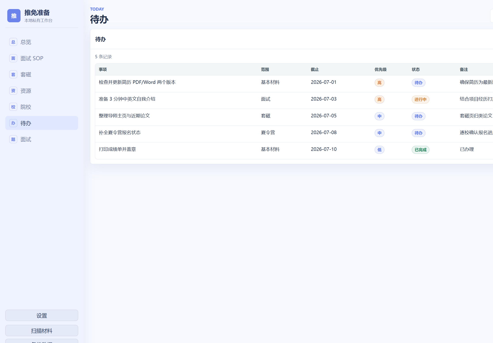
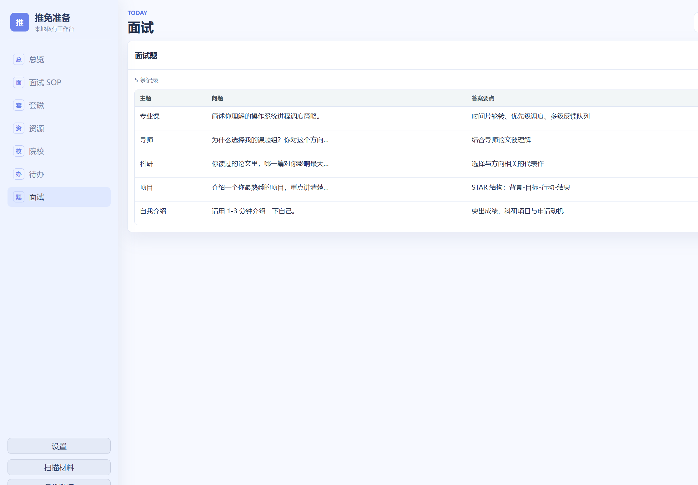

# GradPath

> **本地优先的研究生全流程 SOP 工作台** —— 一个本地优先、隐私友好、开箱即用的通用流程管理工具，覆盖研究生「申请 → 学习 → 科研 → 申博」全生命周期。首个落地场景为 **推免 / 保研准备**。

<p align="left">
  
  
  
  
  
  
</p>

## 项目定位

推免 / 保研不是单纯填几张表，而是一个持续数月、跨多个环节的信息管理过程：

- 院校、学院、夏令营、预推免、九推信息不断变化；
- 导师主页、研究方向、近期论文、套磁信和回复状态分散在不同地方；
- 简历、成绩单、证明材料、报名表、面试稿需要反复修改版本；
- Excel 可以记录进度，但和本地文件、导师信息、院校材料之间的关联并不顺手；
- 在线工具虽然方便，但个人材料、成绩单、证件、套磁记录等内容并不适合随意上传云端。

GradPath 把 **「表格记录」**、**「本地资料管理」**、**「申请进度看板」** 与 **「结构化 SOP 流程」** 连接到同一个轻量网页中，让整个准备过程更清晰、更安全、更容易备份、更有章法。

更进一步，GradPath 采用 **「引擎 + 场景包」** 的可插拔架构：核心引擎保持通用，推免、学习、科研、申博等具体业务以「场景包」形式接入，做到 **一次引擎、多场景复用**。

## 预览

| 总览 | 面试 SOP |
| --- | --- |
|  |  |

| 套磁 | 资源 |
| --- | --- |
|  |  |

| 院校 | 待办 |
| --- | --- |
|  |  |

| 面试 |
| --- |
|  |

## 核心功能

| 模块 | 功能说明 |
| --- | --- |
| **总览** | 数据大屏展示关注院校、入营 / 报名、优营 / 通过、套磁回复 / 发送、待办和近期文件 |
| **面试 SOP** | 幕-阶段-检查项驱动的面试流程看板，带进入/退出条件与必停点校验，逐阶段推进 |
| **套磁** | 管理导师信息、套磁状态、套磁信、相关论文和本地文件，自动合并重复导师展示 |
| **资源** | 按文件夹层级浏览材料，支持搜索、上传、归类、备注、预览和删除，并显示文件类型图标 |
| **院校** | 管理学校、学院 / 项目、申请阶段、截止时间、账号、状态和备注，支持状态排序与同状态手动排序 |
| **待办** | 跟踪任务范围、截止日期、优先级、完成状态和备注 |
| **面试** | 整理面试题、答案要点、主题分类和标签 |
| **设置** | 修改头像、工作台标题、首页横幅、主题配色和页面风格 |
| **备份** | 一键备份本地 SQLite 数据库，降低误删和版本丢失风险 |

## 架构：引擎 + 场景包

GradPath 的核心是「引擎」与「场景」的彻底解耦：

```text
┌─────────────────────────────────────────────┐
│                    engine/                   │
│  数据根 · 场景加载 · 实体 CRUD · 清单 ·        │
│  SOP 阶段引擎 · 文件索引 · 设置 · HTTP 服务     │
│            （通用能力，加场景不改）            │
└─────────────────────────────────────────────┘
                        ▲
                        │ 按约定加载
        ┌───────────────┼───────────────┐
        ▼               ▼               ▼
┌──────────────┐ ┌──────────────┐ ┌──────────────┐
│ scenes/tuimian│ │ scenes/research│ │ scenes/...   │
│  推免场景     │ │  科研场景(规划)│ │  更多场景     │
│ scene.json   │ │ scene.json   │ │              │
│ hooks.py     │ │ hooks.py     │ │              │
└──────────────┘ └──────────────┘ └──────────────┘
```

- **`scene.json`**：用声明式 JSON 描述场景的实体字段、幕-阶段树、检查清单、种子数据、默认设置。
- **`hooks.py`**：承载无法用 JSON 表达的强业务逻辑（文件分类、套磁聚合、总览统计、级联副作用）。
- **加新场景 = 新增 `scenes/<id>/` 目录**，不改动引擎一行代码。

## 团队与分工

| 成员 | 角色 | 主要分工 |
| --- | --- | --- |
| 陈杉杉 | 项目发起人 / 项目经理 | 总体架构设计、通用引擎核心（`engine/`）、场景钩子机制、后端服务、进度统筹 |
| 赵雨欣 | 前端负责人 | 配置驱动的前端渲染、SOP 阶段看板、各页面交互、样式与体验优化 |
| 康赞会 | 测试与文档负责人 | 端到端测试与回归、必停点/条件验证、README 与设计文档撰写、数据种子整理 |

> 详见 [`docs/`](docs/) 目录下的《项目章程》。

## 适合人群

- 正在准备推免、保研、夏令营、预推免、九推的同学；
- 同时关注多个学校、多个学院、多个导师的申请者；
- 需要管理大量简历、成绩单、证明、报名表、套磁信和论文材料的人；
- 希望材料保存在本地，而不是上传到在线系统的人；
- 觉得纯 Excel 不够顺手，但又不想使用复杂管理软件的人。

## 项目特点

### 本地优先

默认优先运行在：

```text
http://127.0.0.1:8848
```

如果该端口被占用或被 Windows 保留，程序会自动选择可用端口并显示实际地址。数据保存在本机，不依赖云服务。

### 隐私友好

个人数据库、头像、备份文件和本地材料目录默认不会提交到 Git：

```text
data/
保研准备/
```

项目适合个人本地使用，不需要注册账号，也不会主动上传个人文件。

### 轻量直接

项目只使用：

- Python 标准库 HTTP 服务；
- SQLite；
- 原生 HTML / CSS / JavaScript。

没有复杂框架，方便阅读、修改和二次开发。

### 文件友好

网页中记录信息，本地文件仍然可以用系统默认程序打开。
PDF、Word、PPT、表格、图片等材料都保留原有文件管理习惯，同时在资源页中获得更清晰的索引和归类。

### 数据可迁移

数据根目录可随时迁移到新位置（六步迁移：暂停写入 → 快照 → 创建并验证 → 复制校验 → 原子切换 → 保留回滚副本），迁移失败可一键回滚，原目录保留。

### 易于扩展

得益于「引擎 + 场景包」分层，扩展成本极低：

- 加新场景（科研 / 申博）只需新增场景目录；
- 加新字段、新清单、新阶段只需改 `scene.json`；
- 已有扩展方向：导师评分、院校优先级、报名材料清单、面试复盘、数据导出、更多看板指标。

## 快速开始

### 1. Windows 快速启动（推荐）

直接双击：

```text
start.bat
```

启动器会校验 Python 环境、自动打开浏览器，并将诊断信息写入 `data/logs/startup.log`。如果系统没有可用的 Python 3，首次启动会从 Python 官网下载仅供本项目使用的独立运行时。

### 2. 使用已安装的 Python 启动

开发者也可以在项目根目录运行：

```powershell
python app.py
```

终端会显示浏览器访问地址。默认是：

```text
http://127.0.0.1:8848
```

### 3. 修改端口

如果默认端口被占用，可以手动指定端口：

```powershell
$env:GRADPATH_PORT="8891"
python app.py
```

然后访问：

```text
http://127.0.0.1:8891
```

### 4. 切换场景

通过环境变量 `GRADPATH_SCENE` 指定要加载的场景包（默认 `tuimian`）：

```powershell
$env:GRADPATH_SCENE="tuimian"
python app.py
```

## 推荐使用流程

1. 将个人申请材料放入 `保研准备/` 目录；
2. 启动项目并进入网页工作台；
3. 在左侧点击 **扫描材料**，同步本地文件索引；
4. 在资源页为文件设置归类，例如：`基本材料`、`套磁`、`院校`、`项目`、`面试`、`参考`；
5. 归类为 `套磁` 的文件，可以关联具体导师；
6. 归类为 `院校` 的文件，可以关联具体学校或项目；
7. 在套磁页集中查看导师信息、套磁信和相关文件；
8. 在院校页集中管理项目时间、账号、状态和备注；
9. 在待办页记录报名、材料、邮件、面试等任务；
10. 在 **面试 SOP** 页按幕-阶段逐项推进，完成检查清单、跨过必停点；
11. 定期点击 **备份数据**，备份 SQLite 数据库。

## 项目结构

```text
.
├── app.py                 # 轻量启动入口
├── launcher.ps1           # Windows 启动器（校验环境、自动开浏览器）
├── engine/                # 通用引擎包（加场景不改）
│   ├── config.py          # 代码根、端口、上传上限
│   ├── dataroot.py        # 数据根锚点、六步迁移、回滚
│   ├── db.py              # SQLite 连接 + 引擎自身表
│   ├── scene.py           # 场景配置加载 + 按场景建表
│   ├── entities.py        # 通用实体 CRUD、排序、备份
│   ├── hooks.py           # 场景钩子加载器
│   ├── sop.py             # SOP 阶段引擎（条件求值 + 必停点）
│   ├── checklist.py       # 通用清单引擎
│   ├── materials.py       # 文件扫描、索引、上传、删除
│   ├── settings.py        # 设置与头像
│   ├── server.py          # HTTP 路由与静态文件服务
│   └── utils.py           # 通用工具
├── scenes/                # 场景包（配置 + 钩子）
│   └── tuimian/
│       ├── scene.json     # 推免场景：实体/清单/幕-阶段树/种子
│       └── hooks.py       # 推免业务钩子（分类/套磁聚合/总览）
├── web/
│   ├── index.html         # 页面入口
│   ├── style.css          # 页面样式
│   └── js/                # 前端模块（main/api/state/ui/... pages/）
├── docs/                  # 项目章程等文档
├── imgs/                  # README 展示截图
└── data/                  # 本地数据库和头像，默认不提交
```

## 本地数据目录

项目运行后，会自动使用或生成本地私有目录：

```text
data/
├─ app.db
├─ backups/
├─ avatar.*
└─ state/                  # 阶段进度/决策日志（JSON）

保研准备/
└─ 网页添加/
```

建议将自己的申请材料统一放在 `保研准备/` 目录下，例如：

```text
保研准备/
├─ 基本材料/
├─ 套磁信/
├─ 论文/
├─ 院校项目/
├─ 夏令营/
├─ 面试/
└─ 网页添加/
```

资源页会扫描本地文件，并按目录层级展示。

## 技术栈

| 层级 | 方案 |
| --- | --- |
| 后端 | Python 标准库 HTTP 服务 |
| 数据库 | SQLite |
| 前端 | 原生 HTML / CSS / JavaScript |
| 架构 | 引擎 + 场景包（配置 + 钩子） |
| 数据位置 | 本机 `data/app.db` |
| 文件位置 | 本机 `保研准备/` |
| 运行方式 | 本地浏览器访问 `127.0.0.1` |

## 路线图

**已完成**

- [x] 引擎骨架：模块拆分与去业务化
- [x] 场景钩子层：业务逻辑下沉至场景包
- [x] SOP 阶段引擎：条件求值器 + 必停点强校验
- [x] 推免面试 SOP 场景：幕-阶段-检查项 + 前端阶段看板
- [x] 端到端验证：CRUD、阶段流转、必停点拦截

**规划中**

- [ ] 学习 / 科研 / 申博场景扩展
- [ ] 数据导出（Markdown / CSV / 报表）
- [ ] 更多看板指标与可视化
- [ ] 面试复盘与评分
- [ ] 社区推广与贡献指南

## 联系方式

如果这个项目对你有帮助，欢迎 Star 本项目。也欢迎交流使用体验、改进建议，或参与场景扩展与功能增强。

- GitHub: [yugan-tano/GradPath](https://github.com/yugan-tano/GradPath)
- Email: `zhanghoubing777@Gmail.com`

## License

本项目基于 [MIT License](LICENSE) 开源。
本网站为开源项目，仅供学习与交流使用，使用风险由用户自行承担。
